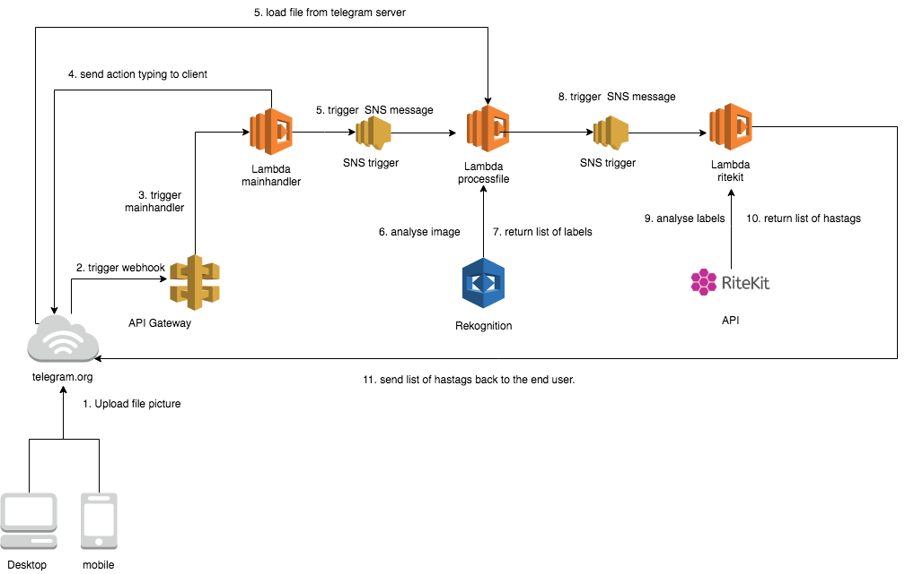

# Telegram hashtag Mania Example

The example demonstrates a Telegram messaging bot that uses the Amazon Rekognition service & Ritekit API to analyse a image and propose popular related hashtags based on content in the uploaded image written in nodejs.

## Capabilities


## Installation
I have written the installation steps for OS X & Linux:

### Step 1. Clone GitHub repository

```sh
npm install -g serverless
install the AWS Command Line Interface
git clone git://github.com/onnobos/hashtagmania.git
cd hashtagmania
npm install
serverless deploy
```

### Step 2 Set telegram API
1. [Register telegram bot with Telegram.org](https://core.telegram.org/bots#botfather)
2. Set the webhook, based URL endpoint mentioned in "Step 1. Clone GitHub repository"
3. Create an empty file called serverless.env.yml with the content below and replace "-TELEGRAM API-" with the telegram API.
```yaml
dev:
    TELEGRAM_API: '-TELEGRAM API-'
    RITEKIT_API: '-RITEKIT API-'
```

### Step 3. Register application on the Ritekit
1. [Sign up for RiteKit](https://ritekit.com/accounts/)
2. Go to [developer dashboard](https://https://ritekit.com/developer/dashboard/)
3. Click "Create a token" button to get your Client ID and Client secret.
4. Replace "-RITEKIT API-" Client ID to file serverless.env.yml file created in step 2.

## Usage example

1. Add your telegram bot (created in step 2) in Telegram message app
2. Enter `/help`
3. Or upload a image with caption.


## Package dependencies
 - [request](https://github.com/request/request)
 - [request-promise](https://github.com/request/request-promise)

## Release History

* 0.0.1
    * Work in progress

## Meta

Onno Bos – twitter [@obeone](https://twitter.com/obeone)

Distributed under the GNU GPLv3 license. See ``GNU GPLv3`` for more information.

[https://github.com/onnobos/hashtagmania.git](https://github.com/onnobos/hashtagmania.git)
